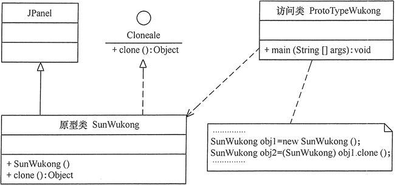
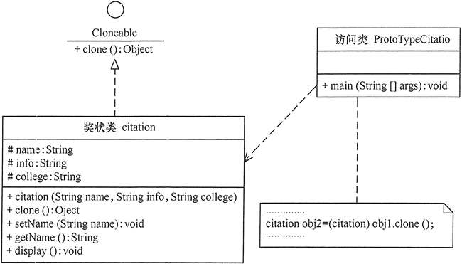
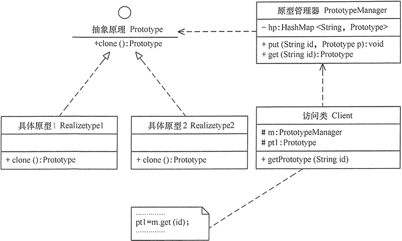

# 原型模式

在有些系统中，存在大量相同或相似对象的创建问题，如果用传统的构造函数来创建对象，会比较复杂且耗时耗资源，
用原型模式生成对象就很高效，就像孙悟空拔下猴毛轻轻一吹就变出很多孙悟空一样简单。

## 原型模式的定义与特点

原型（Prototype）模式的定义如下：**用一个已经创建的实例作为原型，通过复制该原型对象来创建一个和原型相同或相似的新对象。**
在这里，原型实例指定了要创建的对象的种类。用这种方式创建对象非常高效，根本无须知道对象创建的细节。
例如，Windows 操作系统的安装通常较耗时，如果复制就快了很多。

## 原型模式的结构与实现

由于 Java 提供了对象的 clone() 方法，所以用 Java 实现原型模式很简单。

**1. 模式的结构**

原型模式包含以下主要角色。

1. 抽象原型类：规定了具体原型对象必须实现的接口。
2. 具体原型类：实现抽象原型类的 clone() 方法，它是可被复制的对象。
3. 访问类：使用具体原型类中的 clone() 方法来复制新的对象。

其结构图如图 1 所示。


**2. 模式的实现**

原型模式的克隆分为浅克隆和深克隆，Java 中的 Object 类提供了浅克隆的 clone() 方法，
具体原型类只要实现 Cloneable 接口就可实现对象的浅克隆，这里的 Cloneable 接口就是抽象原型类。
其代码如下：

```java
//继承自抽象原型类 Cloneable
//具体原型类
class Realizetype implements Cloneable
  {
  	private String name;
  	
      Realizetype(String name)//构造函数
      {
      	this.name = name;
          System.out.println("具体原型创建成功！");
      }
      public Object clone() throws CloneNotSupportedException
      {
          System.out.println("具体原型复制成功！");
          return (Realizetype)super.clone();
      }//访问类
      public void getName(){
      	System.out.println("我的名字"+this.name);
      }
  }
  //原型模式的测试类
  public class PrototypeTest
   {
       public static void main(String[] args)throws CloneNotSupportedException
       {
           Realizetype obj1=new Realizetype();
           Realizetype obj2=(Realizetype)obj1.clone();
           obj1.getName();
           obj2.getName();
           System.out.println("obj1==obj2?"+(obj1==obj2));
       }
   }
/**
* 输出：
*具体原型创建成功！
*具体原型复制成功！
*我的名字孙悟空
*我的名字孙悟空
*obj1==obj2?false
* 
*/

```
## 原型模式的应用实例

【例1】用原型模式模拟“孙悟空”复制自己。

分析：孙悟空拔下猴毛轻轻一吹就变出很多孙悟空，这实际上是用到了原型模式。
这里的孙悟空类 SunWukong 是具体原型类，而 Java 中的 Cloneable 接口是抽象原型类。

同前面介绍的猪八戒实例一样，由于要显示孙悟空的图像（点击此处下载该程序所要显示的孙悟空的图片）
，所以将孙悟空类定义成面板 JPanel 的子类，里面包含了标签，用于保存孙悟空的图像。

另外，重写了 Cloneable 接口的 clone() 方法，用于复制新的孙悟空。
访问类可以通过调用孙悟空的 clone() 方法复制多个孙悟空，并在框架窗体 JFrame 中显示。
图 2 所示是其结构图。



代码见项目

**用原型模式除了可以生成相同的对象，还可以生成相似的对象**

【例2】用原型模式生成“三好学生”奖状。

分析：同一学校的“三好学生”奖状除了获奖人姓名不同，其他都相同，属于相似对象的复制，
同样可以用原型模式创建，然后再做简单修改就可以了。图 3 所示是三好学生奖状生成器的结构图。



代码见项目

## 原型模式的应用场景

原型模式通常适用于以下场景。

+ 对象之间相同或相似，即只是个别的几个属性不同的时候。
+ 对象的创建过程比较麻烦，但复制比较简单的时候。

## 原型模式的扩展

原型模式可扩展为带原型管理器的原型模式，它在原型模式的基础上增加了一个原型管理器
PrototypeManager 类。该类用 HashMap 保存多个复制的原型，Client 类可以通过管理器的
get(String id) 方法从中获取复制的原型。其结构图如图 4 所示。



【例3】用带原型管理器的原型模式来生成包含“圆”和“正方形”等图形的原型，并计算其面积。
分析：本实例中由于存在不同的图形类，例如，“圆”和“正方形”，它们计算面积的方法不一样，
所以需要用一个原型管理器来管理它们，图 6 所示是其结构图。
  


  
  


