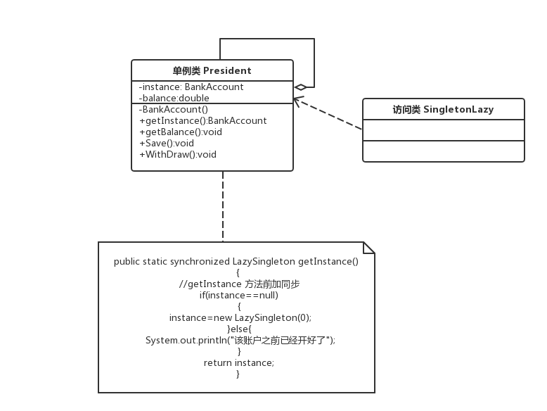
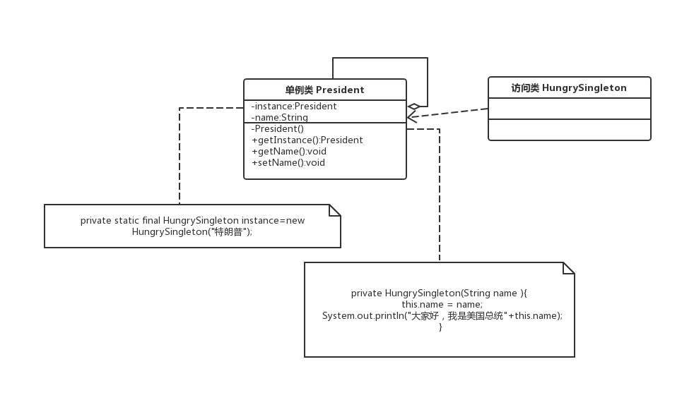

# 单例模式

在有些系统中，为了节省内存资源、保证数据内容的一致性，对某些类要求只能创建一个实例，这就是所谓的单例模式。

## 单例模式的定义与特点

单例模式是设计模式中最简单的模式之一。通常，普通类的构造函数是公有的，
外部类可以通过“new 构造函数()”来生成多个实例。但是，如果 **将类的构造函数设为私有的，
外部类就无法调用该构造函数，也就无法生成多个实例。** 这时该类自身必须定义一个静态私有实例，
并向外提供一个静态的公有函数用于创建或获取该静态私有实例。

### 1. 单例模式的结构

单例模式的主要角色如下。

+ 单例类：包含一个实例且能自行创建这个实例的类。
+ 访问类：使用单例的类。

结构图：


### 2. 单例模式的实现

Singleton 模式通常有两种实现形式。

**第 1 种：懒汉式单例**

该模式的特点是类加载时没有生成单例，只有当第一次调用 getlnstance 方法时才去创建这个单例。代码如下：

```java
public class LazySingleton
{
    private static volatile LazySingleton instance=null;    //保证 instance 在所有线程中同步
    private LazySingleton(){...}    //private 避免类在外部被实例化
    public static synchronized LazySingleton getInstance()
    {
        //getInstance 方法前加同步
        if(instance==null)
        {
            instance=new LazySingleton();
        }
        return instance;
    }
}
```
注意：如果编写的是多线程程序，则不要删除上例代码中的关键字 `volatile` 和 `synchronized`，
否则将存在线程非安全的问题。如果不删除这两个关键字就能保证线程安全，但是每次访问时都要同步，
**会影响性能，且消耗更多的资源**，这是懒汉式单例的缺点。

**第 2 种：饿汉式单例**

该模式的特点是**类一旦加载就创建一个单例**，保证在调用 getInstance 方法之前单例已经存在了。

```java
public class HungrySingleton
 {
     private static final HungrySingleton instance=new HungrySingleton();
     private HungrySingleton(){}
     public static HungrySingleton getInstance()
     {
         return instance;
     }
 }
```

### 单例模式的应用实例

**1.用懒汉式单例模拟银行卡余额**

代码见.java 文件

UML 类图



**2.用饿汉式单例模拟美国总统对象**

代码见.java 文件

UML类图



