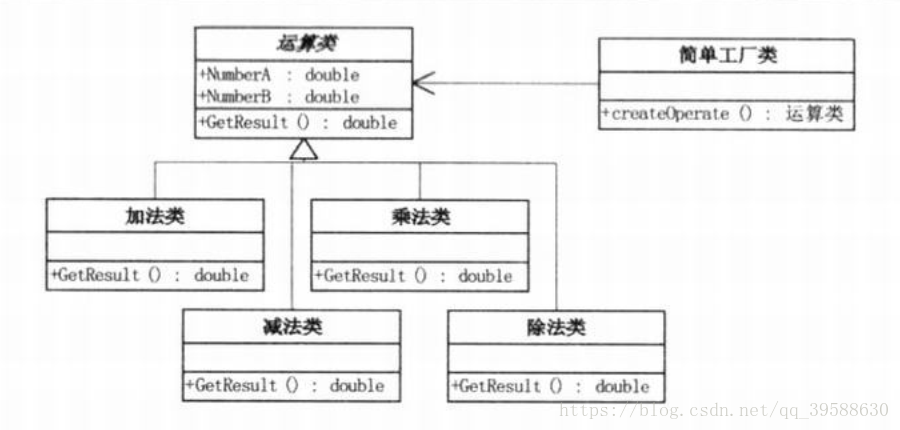

##1.简单工厂模式概述:

简单工厂模式是属于创建型模式，又叫做静态工厂方法（Static Factory Method）模式，但不属于23种GOF设计模式之一。简单工厂模式是由一个工厂对象决定创建出哪一种产品类的实例。简单工厂模式是工厂模式家族中最简单实用的模式，可以理解为是不同工厂模式的一个特殊实现。

##2.简单工厂模式包含的角色及其职责:

+ 工厂角色[Creator]：简单工厂模式的核心，它负责实现创建所有实例的内部逻辑。工厂类的创建产品类的方法可以被外界直接调用，创建所需的产品对象。
+ 抽象产品角色[Product]：简单工厂模式所创建的所有对象的父类，它负责描述所有实例所共有的公共接口。
+ 具体产品角色[Concrete Product]：简单工厂模式的创建目标，所有创建的对象都是充当这个角色的某个具体类的实现。

（1）实现方式：简单工厂模式的实质是由一个工厂类根据传入的参数，动态决定应该创建哪一个产品类（这些产品类继承自一个父类或接口）的实例。

样例中的简单工厂模式的UML类关系:

--------------------- 
作者：LRB_Len 

原文：[CSDN](https://blog.csdn.net/qq_39588630/article/details/80423528)

版权声明：本文为博主原创文章，转载请附上博文链接！